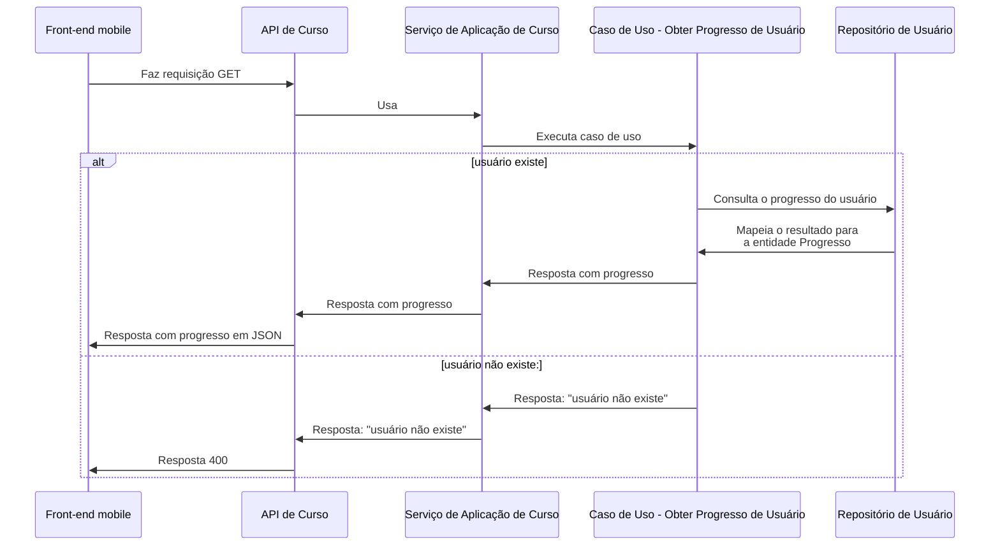
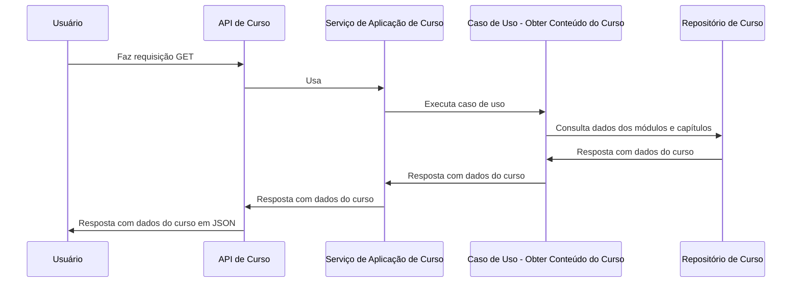
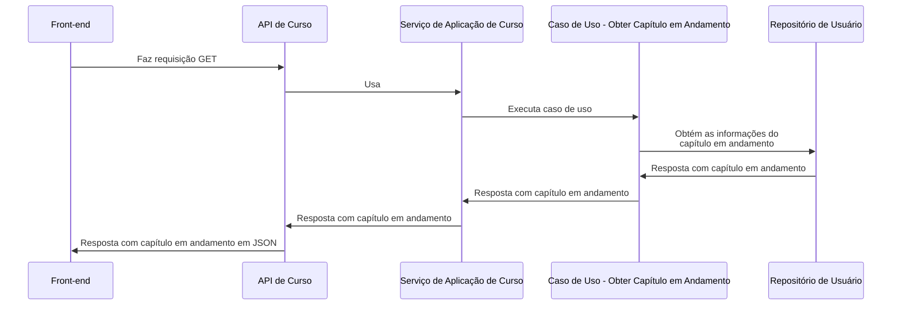
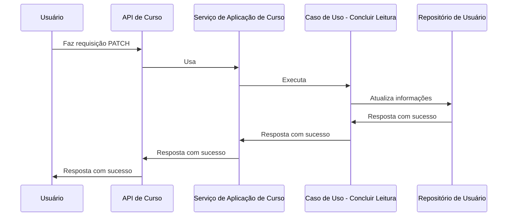
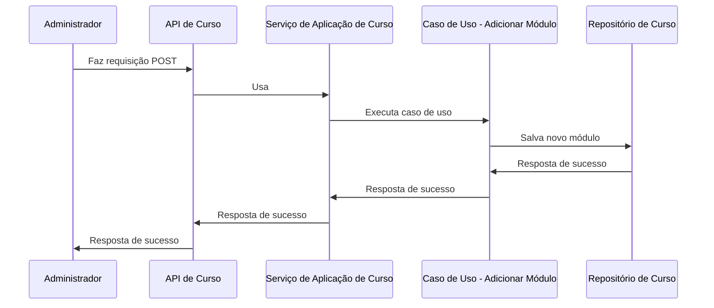
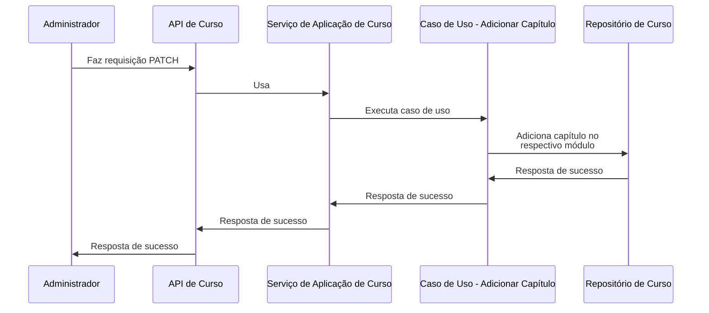
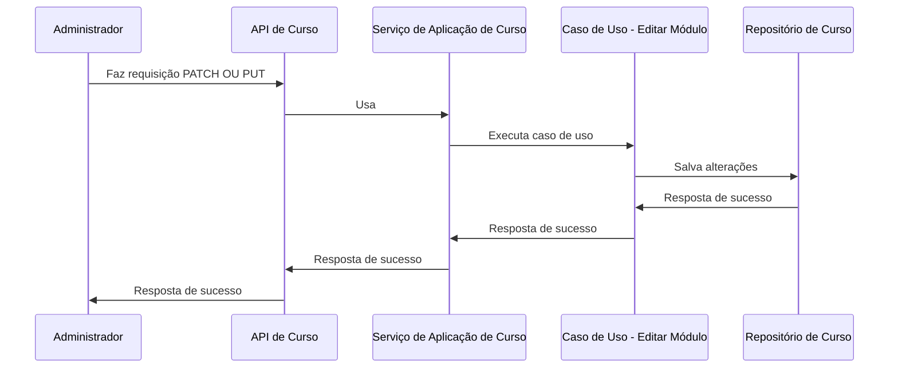
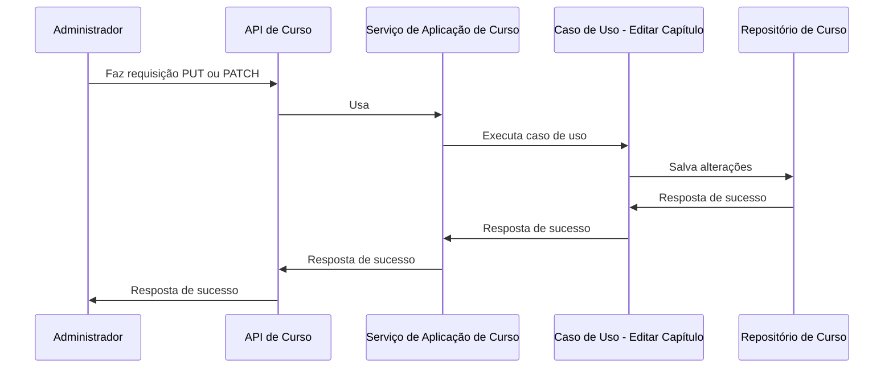

# C3 - Módulo de curso

## Caso de usos

### Obter progresso do usuário

### Obter conteúdo do curso:

### Obter capítulo em andamento:

### Concluir leitura:

### Adicionar módulo (Apenas Administradores):

### Adicionar Capítulo (Apenas Administradores):

### Editar Módulo (Apenas Administradores):

Na edição de um módulo, o front-end é responsável por realizar a solicitação `PUT` ou `PATCH`, dependendo das informações que foram alteradas. Em outras palavras, se o usuário tiver modificado todas as informações no formulário de edição do módulo, o front-end enviará uma solicitação `PUT`. Caso contrário, especificará apenas os campos que foram alterados utilizando o método `PATCH`.

Essa abordagem foi adotada visando evitar a gravação de dados desnecessários no banco de dados e também para prevenir possíveis erros, como a atualização de informações na base de dados sem que elas tenham sido efetivamente alteradas pelo usuário.

### Editar Capítulo (Apenas Administradores):

Na edição de um capítulo, o front-end é responsável por realizar a solicitação `PUT` ou `PATCH`, dependendo das informações que foram alteradas. Em outras palavras, se o usuário tiver modificado todas as informações no formulário de edição do capítulo, o front-end enviará uma solicitação `PUT`. Caso contrário, especificará apenas os campos que foram alterados utilizando o método `PATCH`.

Essa abordagem foi adotada visando evitar a gravação de dados desnecessários no banco de dados e também para prevenir possíveis erros, como a atualização de informações na base de dados sem que elas tenham sido efetivamente alteradas pelo usuário.
