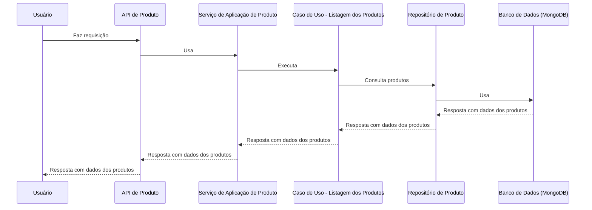
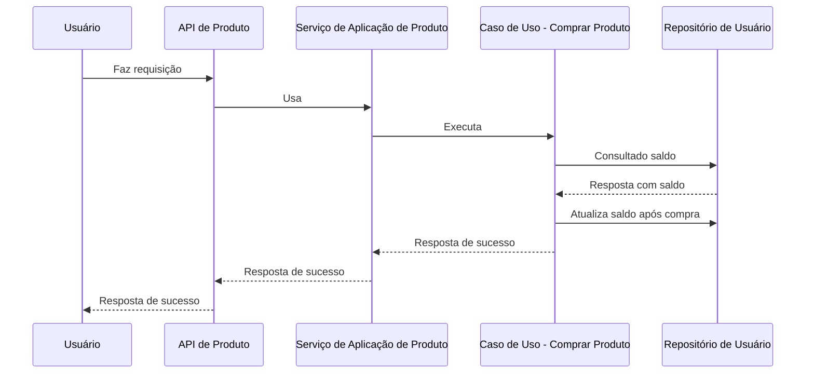
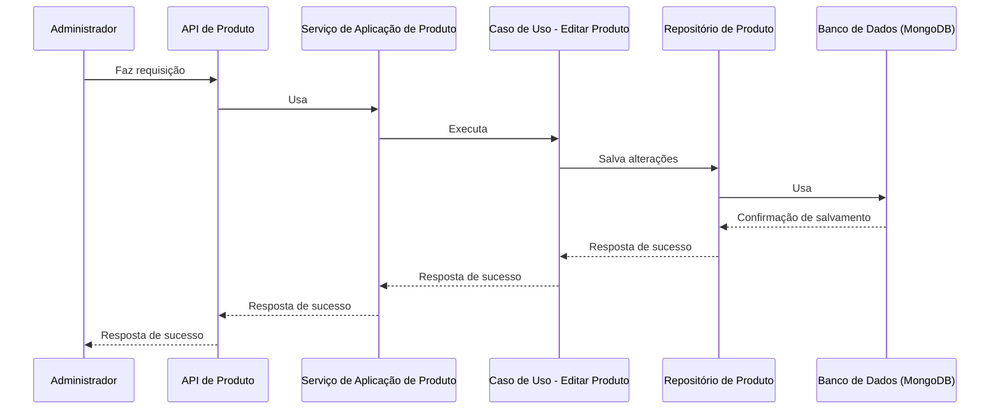
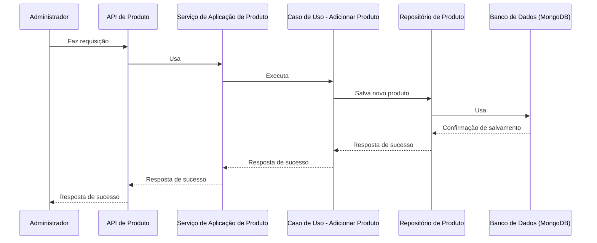

# C3 - Módulo de produto

## **Caso de usos**

### Listagem dos Produtos:

### Comprar Produto:

### Editar Produto (Apenas Administradores):

Na edição de um produto, o front-end é responsável por realizar a solicitação `PUT` ou `PATCH`, dependendo das informações que foram alteradas. Em outras palavras, se o usuário tiver modificado todas as informações no formulário de edição do produto, o front-end enviará uma solicitação `PUT`. Caso contrário, especificará apenas os campos que foram alterados utilizando o método `PATCH`.

Essa abordagem foi adotada visando evitar a gravação de dados desnecessários no banco de dados e também para prevenir possíveis erros, como a atualização de informações na base de dados sem que elas tenham sido efetivamente alteradas pelo usuário.

### Adicionar Produto (Apenas Administradores):

