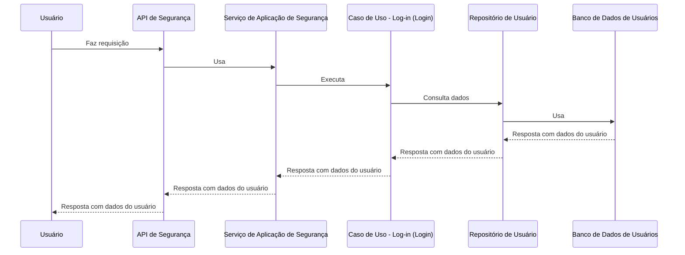
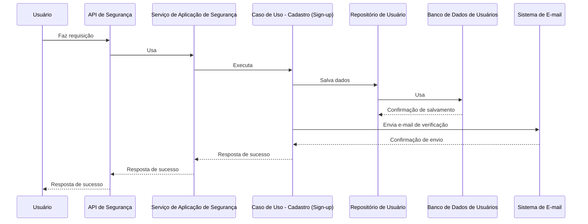
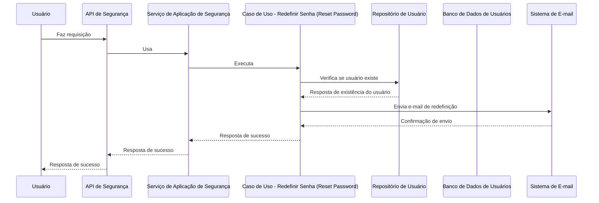

# C3 - Módulo de segurança

## Casos de uso

### Log-in (Login):

```mermaid
sequenceDiagram
    participant user as Usuário
    participant security_api as API de Segurança
    participant security_service as Serviço de Aplicação de Segurança
    participant login_use_case as Caso de Uso - Log-in (Login)
    participant user_repository as Repositório de Usuário
    participant user_db as Banco de Dados de Usuários

    user->>security_api: Faz requisição
    security_api->>security_service: Usa
    security_service->>login_use_case: Executa
    login_use_case->>user_repository: Consulta dados
    user_repository->> user_db: Usa
    user_db-->>user_repository: Resposta com dados do usuário
    user_repository-->>login_use_case: Resposta com dados do usuário
    login_use_case-->>security_service: Resposta com dados do usuário
    security_service-->>security_api: Resposta com dados do usuário
    security_api-->>user: Resposta com dados do usuário
```

### Cadastro (Sign-up):

```mermaid
sequenceDiagram
    participant user as Usuário
    participant security_api as API de Segurança
    participant security_service as Serviço de Aplicação de Segurança
    participant signup_use_case as Caso de Uso - Cadastro (Sign-up)
    participant user_repository as Repositório de Usuário
    participant user_db as Banco de Dados de Usuários
    participant mail as Sistema de E-mail

    user->>security_api: Faz requisição
    security_api->>security_service: Usa
    security_service->>signup_use_case: Executa
    signup_use_case->>user_repository: Salva dados
    user_repository->>user_db: Usa
    user_db-->>user_repository: Confirmação de salvamento
    signup_use_case->>mail: Envia e-mail de verificação
    mail-->>signup_use_case: Confirmação de envio
    signup_use_case-->>security_service: Resposta de sucesso
    security_service-->>security_api: Resposta de sucesso
    security_api-->>user: Resposta de sucesso
```

### Redefinir Senha (Reset Password):

```mermaid
sequenceDiagram
    participant user as Usuário
    participant security_api as API de Segurança
    participant security_service as Serviço de Aplicação de Segurança
    participant reset_pwd_use_case as Caso de Uso - Redefinir Senha (Reset Password)
    participant user_repository as Repositório de Usuário
    participant user_db as Banco de Dados de Usuários
    participant mail as Sistema de E-mail

    user->>security_api: Faz requisição
    security_api->>security_service: Usa
    security_service->>reset_pwd_use_case: Executa
    reset_pwd_use_case->>user_repository: Verifica se usuário existe
    user_repository-->>reset_pwd_use_case: Resposta de existência do usuário
    reset_pwd_use_case->>mail: Envia e-mail de redefinição
    mail-->>reset_pwd_use_case: Confirmação de envio
    reset_pwd_use_case-->>security_service: Resposta de sucesso
    security_service-->>security_api: Resposta de sucesso
    security_api-->>user: Resposta de sucesso
```