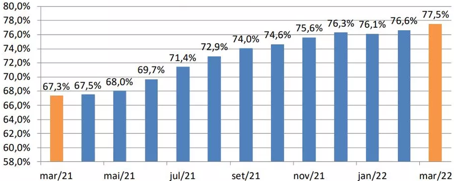
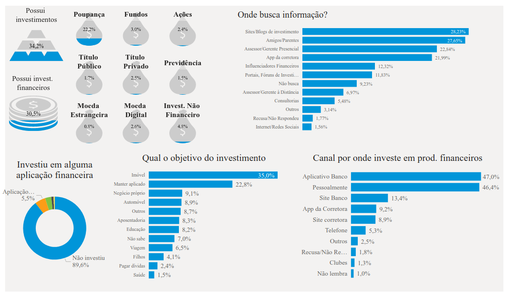
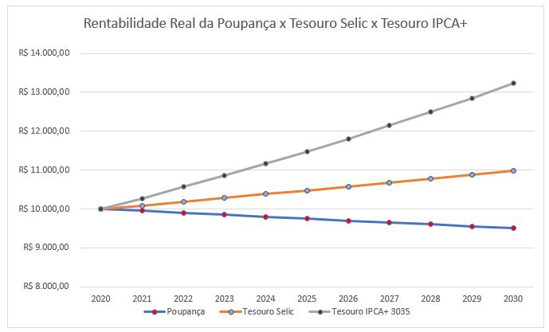
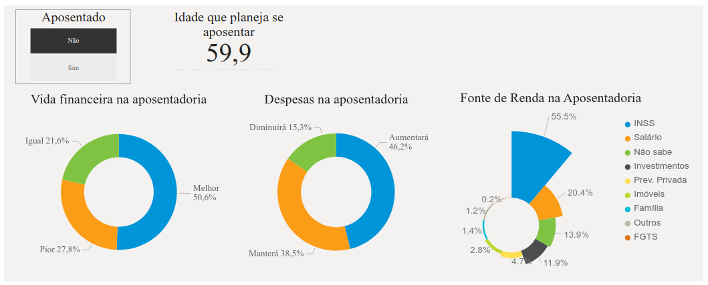
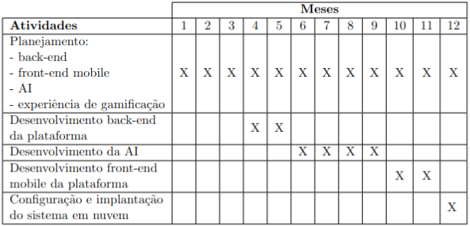

# Visão geral

## Resumo

Este projeto tem por objetivo desenvolver uma ferramenta, denominada Asset Analysis AI (3A), uma plataforma gamificada que faz uso de inteligência artificial "IA" com objetivo de auxiliar as pessoas em atingirem a estabilidade financeira no longo prazo. Tal hipótese se baseia na premissa de que a educação financeira é essencial para a tomada de decisões financeiras eficazes. Entretanto, a maioria da população brasileira não a possui de forma adequada, o que resulta em altos índices de endividamento e baixo número de investidores. Desse modo, esta aplicação tem como objetivo democratizar a educação financeira no qual a gamificação pode tornar o processo de aprendizado mais engajador, favorecendo a retenção de usuários na plataforma. Além disso, a IA pode proporcionar uma ganho de produtividade na seleção de ativos a partir da estratégia de investimento _value investing_ com cálculo de preço teto e sugestão de preço de entrada e saída com base em análise técnica.

## Objetivos

Esse projeto tem como objetivo, democratizar a educação financeira no Brasil que está presente em uma minoria na sociedade, conforme mostra a figura abaixo. Dessa maneira, reduzir o número de devedores no país e proporcioná-los uma vida mais estável por meio dos investimentos.

Além disso, a plataforma é responsável por guiar o investidor no processo de aprendizado sobre mercado financeiro a partir de uma experiência gamificada e com isso favorecer uma maior retenção de usuários na plataforma.

A 3A é uma ferramenta disponibilizado pelo sistema após a conclusão de todos os módulos. Desse modo, o usuário terá um maior aproveitamento dos relatórios criados pela IA.

Portanto, este projeto tem como finalidade auxiliar os usuários em definir um método de investimento consistente e eficiente ao longo prazo a fim de evitar o efeito manada e "investir orientado a notícias".

## Cenário problema

A educação financeira está presente apenas em uma parcela extremamente pequena no Brasil e isso reflete no número de pessoas endividadas no país, cerca de 80% das famílias possuem dívidas, segundo CNN Brasil.

Segundo uma pesquisa realizado em 2022 pela ANBIMA, 5.5% da população investem em alguma aplicação financeira, conforme a figura abaixo: 

Um dado que chama atenção é o número de investidores, cerca de 23%, que utilizam a poupança como principal forma de rentabilizar seu dinheiro. Essa classe de ativo apresenta rentabilidade inferior ao IPCA, ou seja, a inflação reduz o poder de compra das pessoas no longo prazo, como é possível verificar na figura abaixo:

Essas estatísticas são preocupantes para a atual e futuras gerações, uma vez que a Previdência Social contabilizou, em 2022, um déficit de R\$ 261,2 bilhões de reais aponta R7. O INSS está cada vez mais próxima de quebrar devido a inversão da pirâmide etária no país e a má gestão do Governo com manobras políticas. Com isso, é consenso da maioria, segundo Luiz Sacchetto, que é muito provável que as próximas gerações não terão o auxilio financeiro do Estado para a aposentadoria o que impactarão cerca de 55% dos brasileiros dependentes desse sistema para se bancar, conforme mostra a figura abaixo.

Ademais, cerca de 30% dos entrevistados afirmam consultar amigos e/ou familiares ao investir. Tal dado é preocupante, pois eles foram apontados pela BBC Brasil como principais meio de propagação de notícias falsas no país. Desse modos, esses investidores estão sujeitos às notícias, com um tom exagerado de pessimismo, feitos pela mídia o que pode afetar as tomadas de decisões de pessoas iniciando no mercado financeiro.

Por fim, a ansiedade, o "mal do século" segundo Augusto Cury, está atrelado ao fato de apenas 8.3% dos investidores investem com o objetivo de alcançar a liberdade financeira, ou seja, a aposentadoria independente do Estado. Esse problema tem vários impactos no investidor, porém o menos óbvio é o desejo das pessoas de anteciparem algo do futuro para o presente, como por exemplo o financiamentos de veículo ou imóveis, pois para realizar tal proeza existe um prêmio (juros) diretamente proporcional à quantidade de anos desse adiantamento de metas, seja ela moradia ou veículo.

Por tais fatores, apenas 4.28% da população, como mostra a figura anterior, busca formas de acumular patrimônio e alcançar a liberdade financeira no longo prazo, porém para atingir esse objetivo é necessário ter uma educação financeira sólida, disciplina e autocontrole. Desse modo, a 3A tem a finalidade de auxiliá-lo nessa trajetória.

## Estado da Arte e da Prática

Há soluções similares ao da 3A no mercado, como por exemplo a AIA, a Personal Trader da Clear Corretora. Ela é uma ferramenta que busca auxiliar no gerenciamento de risco e gestão emocional de traders ao operar minicontratos. Ambas possuem o mesmo público alvo, os investidores pessoas física, diferentemente de outras opções como Machine Learning for Financial Services da AWS que embora tenham finalidades semelhantes, é direcionado para empresas.

Mesmo que haja soluções relacionadas com essa proposta, há uma baixa quantidade de repositórios públicos com o tópico "investment" no GitHub é de 21 mil contra mais de 330 milhões registrados, segundo o site oficial da plataforma.

Desse modo, por ser uma área recente na tecnologia que está em constante mudança e crescimento, é fundamental a utilização de conceitos e boas práticas que visam a escalabilidade e baixo nível de acoplamento na aplicação.

Primeiramente, a criação de uma boa documentação é essencial para a contribuição da comunidade open source no projeto e para isso será utilizado o C4 model c4model. Ele é uma ferramenta para modelagem de documentação estruturado em 4 etapas: Context, Container, Components, Code. A principal vantagem de usá-lo é a facilidade no design do sistema com base em DDD e Clean Architecture. Além disso, por ser criado via código, "docs as code", têm os benefícios do versionamento de código, como a facilidade no compartilhamento e implantações automatizadas. Para a criação da documentação, o C4 builder proporciona vantagens em produtividade, uma vez que ela fornece um modelo básico, um compilador para converter o código em markdown/PDF e disponibiliza uma versão web. Com isso, a utilização do C4 builder facilitará a disponibilidade do design system do projeto em ambiente web, considerado fundamental uma documentação atualizada e coerente para a contribuição da comunidade.

Além disso, para suportar tal crescimento, ela será desenvolvida com base na arquitetura Clean Architecture com Domain Driven Design "DDD" para a modelagem do domínio do sistema. Essa arquitetura foi criada por Robert C. Martin para modelar uma aplicação em camadas em enterprise business rules, application business rules, interface adapter, frameworks \& drivers. Essa divisão garante a independência em relação a tecnologia utilizada e, principalmente, a testabilidade do software. Desse modo, facilitando a manutenção do mesmo no longo prazo, além de facilitar a adição de novas funcionalidades por causa do baixo nível de acoplamento entre os componentes. Já o DDD é uma filosofia de desenvolvimento elaborada por Eric Evans para facilitar a criação de aplicações complexas. A metodologia proposta pelo DDD é baseado em três pilares: linguagem ubíqua, ou seja, um glossário com explicações de conceitos utilizados no projeto que tanto os desenvolvedores quanto os domain experts consigam entender; Bounded Contexts é a decomposição do domínio em contextos com responsabilidades bem definidas com o auxilio da linguagem ubíqua, além disso os contextos podem ser classificados na seguinte ordem, "principal", "genérico" e "auxiliar"; Context Map é o mapeamento das relações entre os Bounded Contexts por meio da atribuição de upstream para o contexto com mais relevância em relação ao outro (downstream) a partir disso criar camadas de anticorrupção a fim de reduzir o acoplamento na aplicação.

O GitHub será a plataforma responsável por armazenar o código-fonte do projeto, disponibilizá-lo aos usuários interessado nessa proposta e também como um local de discussão (aba Discussions e Issues) para o aprimoramento do sistema. Assim, para comportar e padronizar o tráfico paralelo de mudanças no projeto, será adotado o modelo de fluxo de trabalhado GitHub Flow github_flow que consiste na criação de branchs para cada funcionalidade ou correção de bug, além de utilizar padrões como atomic commits e conventional commits para a criação de commits com mudanças específicas e com mensagens descritivas. Desse modo, facilita a publicação de releases automaticamente por meio de GitHub Actions como Automatic Releases.

Paralelamente à premissa na utilização da Clean Architecture, a implementação de boas práticas e padrões de projetos é essencial para a manutenção e crescimento de projetos open source como este. Assim o uso de SOLID e Clean Code clean_code são pré-requisitos no desenvolvimento desta aplicação, uma vez que tanto o código como a arquitetura estão alinhadas para a redução de custos de manutenção no longo prazo e também atrair desenvolvedores para contribuições futuras.

Por fim, o TensorFlow será o responsável pelo desenvolvimento do núcleo da aplicação, a IA. Os motivos pela escolha dessa ferramento é por ser uma biblioteca desenvolvido pela equipe do Google Brains para suportar o deep learning e outras tarefas de aprendizado de máquina. Essa ferramenta permite que os usuários definam e executem cálculos envolvendo matrizes multidimensionais (tensores) com eficiência em CPUs e GPUs que é fundamental para a análise de dados.

## Desafio Tecno-científico

Existem os seguintes desafios tecno-científicos a serem superados durante o desenvolvimento do projeto:

1. Criação da rede neural para reconhecer comportamentos catalogados para a análise de gráficos candlestick;

2. Modelo matemático base para a análise de ativos e a seleção dos mais rentáveis para a criação da carteira previdenciária;

## Proposta de solução

As possíveis soluções para os desafios listados anteriormente, são respectivamente:

1. Utilização do TensorFlow para o reconhecimento de padrões como: Hammer, Morning Star, Hanging Man, Evening Star, Bullish Engulfing e Bearish Engulfing em gráficos candlestick

2. Os modelos de seleção de carteiras de investimentos proposto por Markowitz e Athayde \& Floôres Jr. se provaram eficaz conforme a pesquisa feito por João Francisco Neves

## Procedimentos Metodológicos

O planejamento do design system será realizado pelo C4 model, que é uma técnica de notação gráfica por meio de código. Além disso, para facilitar o desenvolvimento dessa modelagem será usado o C4 builder que fornece um template, opções de compilação para markdown/PDF e uma aplicação web da documentação.

Por fim, o mapeamento de tarefas com KanBan a partir da decomposição de cada funcionalidade em pequenos blocos com objetivos bem definidos, a fim de reduzir a complexidade e aumentar a produtividade, seguindo o atomic commits. Para isso, será utilizado a aba "Projects" no repositório GitHub do projeto para automatizar os processos no KanBan.

Sendo assim, o estágio de desenvolvimento do projeto é dividido em quatro etapas:

1. Desenvolvimento da funcionalidade;

2. Criação de testes a fim de garantir o comportamento esperado definido na etapa de planejamento:

    - Testes unitários: obrigatório para cada função dentro da aplicação;

    - Testes de integração: apenas para validar a interação com serviços externos, por exemplo: banco de dados e serviços de terceiros (e-mail);

    - Testes end-to-end (E2E): validação de interfaces essenciais como: cadastro e listagem de relatórios.

3. Criação de um pull request com as alterações necessárias para a conclusão da respectiva tarefa no KanBan

4. Após a conclusão do pipeline de Continuos Integration (CI) e possíveis correções de bugs, as modificações são aprovadas e prontas para serem colocadas em produção.

## Cronograma de Atividades

O projeto deve manter o seguinte cronograma de atividades:

## Cenário de Aplicação e Impactos

Este produto tem como público alvo pessoas, principalmente aquelas que estão iniciando no mercado financeiro, pois elas usufruirão da plataforma de ensino para aperfeiçoar seus conhecimentos sobre finanças e utilizarão a 3A para auxiliá-los nas tomadas de decisões.

Entretanto, empresas, casas de análises e corretoras podem utilizar a IA para aumentar a produtividade uma vez que ela fornece nos relatórios os ativos mais rentáveis da bolsa, com os preços tetos, possível preço de entrada e saída. Além disso, para esse nicho, a plataforma permitirá a combinação de vários modelos para montar relatórios customizados.

A principal vantagem na utilização dessa ferramenta é que ela é capaz de processar grandes volumes de dados em um curto período de tempo e providenciar resultados com a menor margem de erro possível. 

## Nível de Maturidade Tecnológica

O projeto se encaixa no nível 9 na escala Technology Readiness Level, pois já existem soluções no mercado de IA para análise de investimentos, como por exemplo: Altair, AWS e AIA / Personal Trader da Corretora Clear time_master_clear No caso da AWS, esse tipo de serviço é utilizado por mais de 100 mil consumidores e isso comprova a maturidade em diversas condições desse tipo de tecnologia.