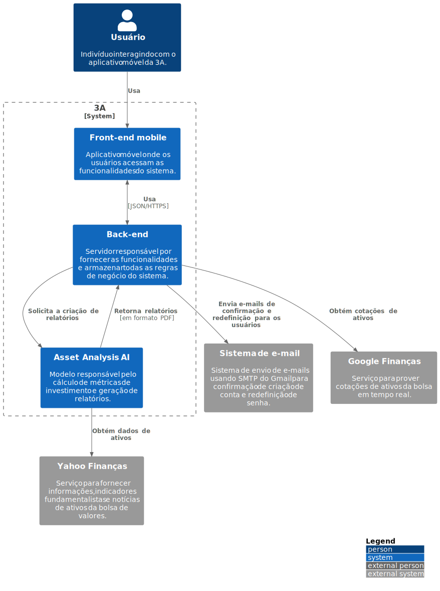

# C1 - Contexto

### **Usuário**

O usuário seria uma pessoa que usa o aplicativo 3A em um celular Android ou IOS. No sistema, ele pode ter 3 cargos diferentes:

1. **Estudante**: o cargo de estudante é o cargo padrão quando um usuário se cadastra no sistema.

2. **Investidor**: quando o usuário completa todos os módulos do curso, é atribuído o cargo de **investidor** e então é possível comprar a inteligência artificial para criação de relatórios customizados (Asset Analysis AI) na loja do aplicativo.

3. **Administrador**: o cargo de administrador é responsável por configurar as recompensas de conclusão de módulos e capítulos, adição de conteúdos no curso e prestar suporte aos usuários.

### **Asset Analysis AI (3A)**

O projeto _Asset Analysis AI_ (3A) é uma plataforma gamificada que faz uso de inteligência artificial "IA" com objetivo de auxiliar as pessoas em atingirem a estabilidade financeira no longo prazo. Desse modo, esta aplicação tem como objetivo democratizar a educação financeira no qual a gamificação pode tornar o processo de aprendizado mais engajador, favorecendo a retenção de usuários na plataforma. Além disso, a IA pode proporcionar uma ganho de produtividade na seleção de ativos a partir da estratégia de investimento _value investing_ com cálculo de preço justo e otimização de carteiras com base na Teoria Moderna do Portfólio de Markowitz.

### **Sistema de e-mail**

O sistema de e-mail adotado é o Gmail, que utiliza o protocolo Simple Mail Transfer Protocol (SMTP). Essa escolha foi feita devido à integração com o ecossistema Spring, baseado nesse protocolo, especificamente o Spring Email.

O sistema de e-mail é empregado em diversos cenários, tais como:

1. Envio de e-mail de confirmação de conta quando um usuário se cadastra na plataforma, direcionado ao endereço de e-mail fornecido durante o cadastro.

2. Envio de e-mail de redefinição de senha quando um usuário solicita a alteração da mesma, direcionado ao endereço de e-mail especificado durante a solicitação.

3. Caso o usuário opte por receber notificações, é utilizado o sistema de e-mail para enviar essas notificações. Essa opção pode ser habilitada na seção "Perfil" do aplicativo.

### **Google Finanças**

O Google Finanças é uma plataforma online gratuita, fornecida pelo Google, que disponibiliza informações financeiras e recursos relacionados ao mercado de ações. Os usuários podem realizar pesquisas e acompanhar as cotações de ações, índices financeiros e moedas.

A escolha de utilizar o Google Finanças para obter a cotação dos principais índices do mercado financeiro baseou-se na necessidade de realizar solicitações frequentes para atualizar as cotações a cada 20 minutos, uma vez que outros serviços cobram por esse acesso ou impõem restrições rigorosas às consultas desses dados.

Além disso, ao utilizar esse serviço do Google, tem-se a garantia de uma entrega contínua e confiável desses dados, sem falhas ou inconsistências.

### **Yahoo Finanças**

O Yahoo Finanças é uma plataforma online gratuita que fornece informações abrangentes sobre o mercado financeiro, incluindo cotações de ações, índices financeiros, moedas, commodities, gráficos e notícias atualizadas. A plataforma oferece recursos avançados, como análise técnica, rastreamento personalizado de portfólio e insights de mercado. Além disso, disponibiliza informações sobre empresas, dados históricos e dividendos.

A escolha do Yahoo Finanças para fornecer dados para a inteligência artificial na criação de relatórios de investimento se deve à disponibilidade gratuita de informações e dados financeiros de empresas listadas em bolsas. Existem bibliotecas em Python, como o [yFinance](https://pypi.org/project/yfinance/) e o [yahooquery](https://pypi.org/project/yahooquery/), que facilitam a coleta padronizada e normalizada desses dados.

Embora o Yahoo tenha imposto algumas limitações no uso da API do Yahoo Finanças, ainda é uma fonte confiável e atualizada de dados para o treinamento da inteligência artificial e a criação de relatórios para os usuários da plataforma.

Para evitar impactos na IA devido às limitações do Yahoo Finanças, foi adotado o Google Finanças para a coleta de cotações de índices de mercado. Isso garante o bom funcionamento da IA sem prejudicar o uso do serviço do Yahoo.