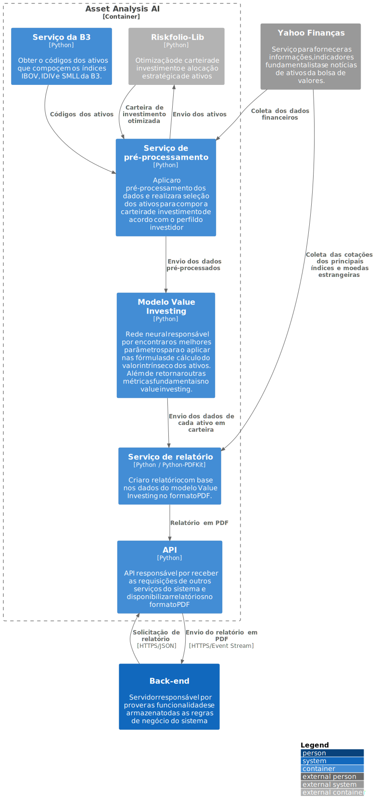

# C2 - Asset Analysis AI

## **Conteúdo do relatório**

- Gráfico de rentabilidade acumulada e composição de ativos da carteira

  

- Tabela com os pesos e preço teto para cada ativo

  | Ativo                         | Peso  | Preço Atual | Preço Teto | Viés     |
  | ----------------------------- | ----- | ----------- | ---------- | -------- |
  | ITUB4 (Itaú)                  | 10.0% | R$ 28,50    | R$ 30,00   | Comprar  |
  | PETR4 (Petrobras)             | 6.0%  | R$ 27,80    | R$ 28,50   | Comprar  |
  | VALE3 (Vale)                  | 8.0%  | R$ 84,20    | R$ 80,00   | Aguardar |
  | BRCR11 (FII BTG Pactual)      | 5.0%  | R$ 113,50   | R$ 110,00  | Aguardar |
  | HGLG11 (FII CSHG Logística)   | 10.0% | R$ 190,00   | R$ 200,00  | Comprar  |
  | BOVA11 (ETF Ibovespa)         | 15.0% | R$ 135,00   | R$ 130,00  | Aguardar |
  | SMAL11 (ETF Small Caps)       | 4.0%  | R$ 95,70    | R$ 100,00  | Comprar  |
  | BBDC4 (Bradesco)              | 7.0%  | R$ 20,15    | R$ 22,00   | Comprar  |
  | BBAS3 (Banco do Brasil)       | 10.0% | R$ 33,80    | R$ 35,50   | Comprar  |
  | KNRI11 (FII Kinea Renda)      | 10.0% | R$ 173,00   | R$ 170,00  | Aguardar |
  | HGRE11 (FII CSHG Real Estate) | 7.0%  | R$ 202,00   | R$ 200,00  | Aguardar |
  | BOVV11 (ETF S&P 500)          | 6.0%  | R$ 170,00   | R$ 175,00  | Comprar  |
  | IVVB11 (ETF S&P 500)          | 4.0%  | R$ 168,00   | R$ 170,00  | Comprar  |
  | GOLL4 (Gol Linhas Aéreas)     | 3.0%  | R$ 23,50    | R$ 25,00   | Comprar  |
  | LREN3 (Lojas Renner)          | 5.0%  | R$ 46,80    | R$ 45,00   | Aguardar |

  > O cálculo dos pesos e do preço teto é com base nos modelos matemáticos, respectivamente: otimização de _Markowitz_ e valor intrínseco.

- Gráfico de contribuição de Risco por ativo e retornos da Carteira

  
