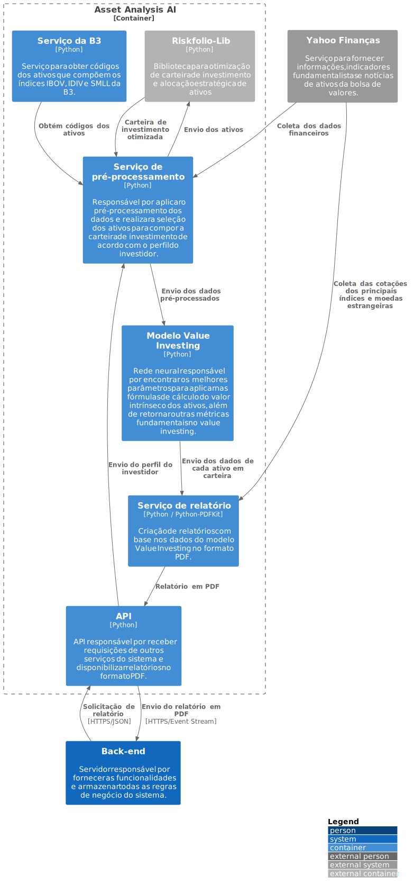

# C2 - Asset Analysis AI



## **Conteúdo do relatório**

```markdown
# Relatório do dia 14/08/2023

## Visão geral

|    IBOV    | SMALL |   IFIX   |  S&P500  | Dow Jones | Dólar | Euro |
| :--------: | :---: | :------: | :------: | :-------: | :---: | :--: |
| 117.001,84 | 2.250 | 3.213,95 | 4.478,55 | 35.245,98 | 4,95  | 5,41 |

Gráfico de setor para representar os pesos ideais para cada ativo.


Gráfico de dispersão para mostrar a relação risco e rentabilidade dos ativos da carteira.


## Análise de ativos

### VALE3

Gráfico de linha para mostrar o retorno acumulado do ativo VALE3 nos últimos 5 anos.


- Preço atual: R$ 67,00
- Peso: 7.5%
- Preço justo: R$ 73,00
- Margem de segurança: 34%
- Risco (0 a 100): 40
- Recomendação: COMPRAR

### ITUB4

...

## Rentabilidade da carteira

Gráfico de linha para representar o retorno acumulado da carteira e comparar com o IBOV, CDI e IPCA.


```

## Riskfolio Lib

### Modelo de otimização de carteira

A Teoria Moderna do Portfólio, desenvolvida por Harry Markowitz na década de 1950, é um dos pilares fundamentais da finança moderna e oferece uma abordagem quantitativa para a seleção de ativos em uma carteira de investimentos. Essa teoria revolucionou a maneira como os investidores consideram o risco e o retorno ao construir suas carteiras, introduzindo conceitos-chave como risco-retorno, fronteira eficiente, Capital Market Line (CML) e carteira ótima.

**1. Risco-Retorno:**

- O conceito de risco-retorno é central na Teoria Moderna do Portfólio. Ele afirma que os investidores procuram maximizar seus retornos esperados enquanto minimizam o risco associado a esses retornos.

- O "retorno" é a medida de ganho ou perda de um investimento ao longo do tempo, enquanto o "risco" é a variabilidade dos retornos em relação à média esperada.

**2. Fronteira Eficiente:**

- A fronteira eficiente representa a combinação ótima de ativos que oferece o maior retorno esperado para um determinado nível de risco.

- A fronteira eficiente é definida como a curva que conecta todos os portfólios possíveis de ativos, onde nenhum portfólio na curva é superado por outro em termos de retorno para um dado nível de risco.

**3. Carteira Ótima:**

- A carteira ótima é o ponto na fronteira eficiente que melhor se adéque ao perfil de risco e preferências do investidor.

- A escolha da carteira ótima depende da relação entre o nível de risco que o investidor está disposto a assumir e o retorno esperado que ele deseja alcançar.

- Investidores com diferentes níveis de aversão ao risco escolherão diferentes pontos ao longo da fronteira eficiente.

**4. Capital Market Line (CML):**

- A CML é uma linha tangente à fronteira eficiente que representa todas as combinações possíveis de um ativo de risco e um ativo livre de risco.

- O ativo livre de risco é frequentemente considerado como um título do governo ou um título com retorno conhecido e sem risco de inadimplência.

- A CML mostra a relação linear entre o retorno esperado e o risco para a carteira composta por um ativo livre de risco e um portfólio de ativos de risco.

A Teoria Moderna do Portfólio enfatiza a diversificação como forma de reduzir o risco total de uma carteira sem sacrificar o retorno esperado. Ela introduziu conceitos matemáticos, como a covariância, para quantificar a relação entre ativos e a importância de considerar a diversificação ao tomar decisões de investimento. A eficiência da diversificação é demonstrada pela fronteira eficiente, que ilustra como os investidores podem otimizar suas carteiras para maximizar o retorno esperado para qualquer nível de risco.

Após o entendimento do modelo de Markowitz, será apresentado alguns argumentos que culminaram na escolha desse modelo no sistema:

- **Consideração das preferências do investidor**: A Teoria de Markowitz permite a personalização das carteiras de acordo com o perfil de risco e as preferências de cada investidor. Isso é fundamental, uma vez que uma das principais premissas do projeto é a flexibilidade na criação de relatórios direcionados para cada tipo de investidor.

- **Modelagem de carteiras diversificadas**: Dado que o sistema visa a auxiliar o investidor na construção de carteiras de investimento, a Teoria de Markowitz oferece uma recurso úteis para criar carteiras diversificadas. Tais recursos são a utilização do Capital Market Line e da fronteira eficiente para a customização na alocação em cada classe de ativo de acordo com o perfil do investidor.

- **Alinhamento com objetivos de longo prazo**: A abordagem de Markowitz, ao otimizar a carteira para o equilíbrio entre risco e retorno, se encaixa bem com investidores que têm objetivos de longo prazo, como a liberdade financeira.

## Modelo Value Investing

Esse modelo será uma rede neural Perceptron multicamada (_feed forward_) responsável pelo cálculo dos melhores parâmetros para cada ativo ao aplicar a fórmula do valor intrínseco para tentar estimar o valor real de um ativo com base em seus fundamentos subjacentes. Nesse modelo será utilizado duas das principais fórmulas e conceitos relacionados ao valor intrínseco:

1. **Fluxo de Caixa Descontado (DCF)**:

   O modelo DCF é frequentemente usado para calcular o valor intrínseco de ações. Ele se baseia no fluxo de caixa futuro esperado que uma empresa pode gerar e traz esses fluxos de caixa futuros a valor presente usando uma taxa de desconto adequada. A fórmula básica é:

   $$
   \text{Valor Intrínseco} = \sum_{t=1}^{n}{\frac{\text{Fluxo de Caixa Futuro}}{(1 + \text{Taxa de Desconto})^t}}
   $$

   - $\text{Fluxo de Caixa Futuro}$: O montante projetado de dinheiro que a empresa gerará em cada período futuro.

   - $\text{Taxa de Desconto}$: Representa o custo de oportunidade ou o retorno mínimo exigido pelos investidores para assumir o risco do investimento.

   - $\text{Período}$: O número de períodos futuros para os quais será projetado os fluxos de caixa.

   Nesse caso, a rede neural deverá ser capaz de encontrar os valores dos parâmetros $\text{Fluxo de Caixa Futuro}$ e $\text{Taxa de Desconto}$ que melhor se encaixa para cada ativo.

2. **Modelo de Gordon**:

   Para empresas que pagam dividendos regulares, o modelo de valorização de dividendos é usado. Ele se concentra nos dividendos esperados que um investidor receberá ao longo do tempo. A fórmula simplificada é:

   $$
   \text{Valor Intrínseco} = \frac{\text{Dividendos por ação}}{\text{K} - \text{G}}
   $$

   - $\text{Dividendos por ação}$: O dividendo por ação esperado nos próximos doze meses.

   - $\text{K}$: A taxa de desconto que representa a taxa de retorno esperado pelo investidor (ou Custo Médio Ponderado de Capital, WACC).

   - $\text{G}$: A taxa de crescimento dos dividendos na perpetuidade

   Nesse caso, a rede neural deverá ser capaz de encontrar os valores dos parâmetros $\text{Dividendos por ação}$, $\text{K}$ e $\text{G}$ que melhor se encaixa para cada ativo. Além disso, ele deve aplicar esse modelo apenas em ações consideradas boas pagadoras de dividendos (com base no histórico da empresa).

Abaixo está descrito o fluxo de desenvolvimento desse modelo:

1. **Pré-processamento dos dados**:

   - Coleta do código dos ativos que compõem os índices [IBOV](https://www.b3.com.br/pt_br/market-data-e-indices/indices/indices-amplos/indice-ibovespa-ibovespa-composicao-da-carteira.htm), [IDIV](https://www.b3.com.br/pt_br/market-data-e-indices/indices/indices-de-segmentos-e-setoriais/indice-dividendos-idiv-composicao-da-carteira.htm) e [SMLL](https://www.b3.com.br/pt_br/market-data-e-indices/indices/indices-de-segmentos-e-setoriais/indice-small-cap-smll-composicao-da-carteira.htm) no site da B3

   - Coleta do preço de fechamento ajustado (`Adj Close`) e calculo da variação percentual diária de cada ativo.

   - Seleção dos ativos com base na Teoria Moderna do Portfólio de Markowitz usando a biblioteca [Riskfolio Lib](https://github.com/dcajasn/Riskfolio-Lib).

   - Coleta dos dados financeiros dos ativos em carteira via yFinance e cálculo de indicadores fundamentalistas

2. **Arquitetura da rede neural**:

   - _Multilayer Perceptron_

   - O número de camadas ocultas e neurônios em cada uma será definido por meio experimental. Entretanto será configurado inicialmente 2 camadas ocultas e com o número de neurônio definido pela fórmula abaixo:

     $$
     \text{Neurônios ocultos} = \frac{\text{Neurônios de entrada} + \text{Neurônios de saída}}{2}
     $$

   - Escolha da funções de ativação: ReLU (Rectified Linear Unit)

     A função de ativação ReLU (Rectified Linear Unit) transforma qualquer valor negativo em zero e mantém os valores positivos intactos. A função ReLU é definida como:

     $$
     f(x) = \begin{cases}
     x, & \text{se } x > 0 \\
     0, & \text{se } x \leq 0
     \end{cases}
     $$

     O racional por trás da utilização da função ReLU nas camadas ocultas e na camada de saída, pois se deve ao fato de que o atributo meta requer que os valores positivos sejam mantidos, pois eles correspondem ao "valor intrínseco" do ativo em questão.

- Escolha da função de perda e otimização:

  - Escolha uma função de perda para o cálculo do erro do modelo: _Mean Square Error_ (MSE)

    O MSE (ou erro média quadrático) é uma métrica que calcula a média dos quadrados das diferenças entre as previsões do modelo e os valores reais. Ele dá maior peso a erros maiores, pois o quadrado dos erros amplifica as discrepâncias.

    A fórmula do MSE para um conjunto de dados com $n$ exemplos é:

    $$
    MSE = \frac{1}{n} \sum_{i=1}^{n} (y_i - \hat{y_i})^2
    $$

    Onde:

    - $y_i$ é o valor real do exemplo $i$

    - $\hat{y_i}$ é a previsão do modelo para o exemplo $i$.

    A escolha do MSE foi embasada no entendimento de que, dadas as particularidades desse sistema, erros mais significativos devem ser mais fortemente penalizados.

  - Escolha do otimizador para ajustar os pesos da rede durante o treinamento: _Stochastic Gradient Descent_ (SGD)

    O SGD atualiza os pesos a cada iteração, utilizando apenas um exemplo de treinamento por vez. Isso torna o SGD mais rápido a cada iteração, mas também resulta em convergência mais ruidosa, pois as atualizações são menos estáveis devido à variabilidade dos exemplos individuais, ou seja, eventualmente pode pular o mínimo global (local com o erro mínimo). Esse algoritmo de otimização tende a ser mais veloz e requer menos recursos de memória.

4. **Treinamento e teste**:

   - Separação dos dados em conjuntos de treinamento (75%) e teste (25%) para a avaliação de desempenho do modelo em dados não vistos durante o treinamento e evitar o _underfitting_ e _overfitting_.

   - Ajuste dos pesos para minimizar a função de perda.

   - Avaliação do desempenho do modelo usando os dados de teste com métricas de desempenho, precisão, acurácia, matriz de confusão e F1-Score.

   - Ajuste dos hiperparâmetros (como taxa de aprendizado) com base na estratégia de busca aleatória (_Random Search_) juntamente com a validação cruzada (_Cross-Validation_). (**em análise**)

     - Definição da faixa de hiperparâmetros: primeiramente, determinar um intervalo de valores possíveis para cada hiperparâmetro a ser ajustado (número de camadas ocultas, número de neurônios em cada camada, taxa de aprendizado).

     - Aplicação do Random Search: em cada iteração, selecionar aleatoriamente um conjunto de valores de hiperparâmetros dentro das faixas definidas.

     - Treinamento e validação cruzada: para cada conjunto de hiperparâmetros selecionado, executar a validação cruzada.

     - Avaliação do desempenho: avaliar o desempenho do modelo em cada iteração da busca aleatória usando as métricas de desempenho.

     - Seleção do melhor conjunto: ao final das iterações, escolher o conjunto de hiperparâmetros que resultou no melhor desempenho nas métricas avaliadas.

5. **Avaliação Final**:

   - Depois de obter um modelo treinado e testado, submetê-lo a uma nova base de dados para prever resultados.

   - Avaliação final do desempenho do modelo e realizar a comparação com as métricas de otimização esperadas. (**em análise**)

6. **Integração no sistema**
