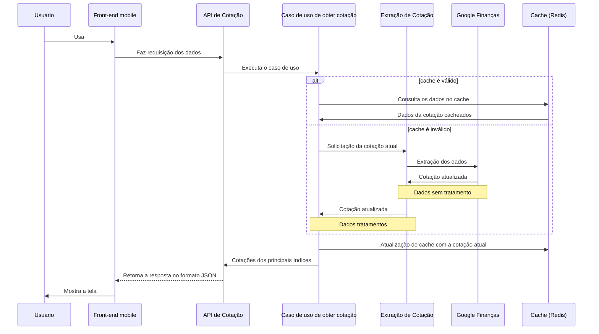

# C3 - Módulo de cotação

## Casos de uso

### Obter cotações dos principais índices

```mermaid
sequenceDiagram
    participant user as Usuário
    participant mobile as Front-end mobile
    participant quotation_api as API de Cotação
    participant get_quotation_usecase as Caso de uso de obter cotação
    participant quotation_scrapper as Extração de Cotação
    participant google_finance as Google Finanças
    participant redis as Cache (Redis)

    user->>mobile: Usa
    mobile->>quotation_api: Faz requisição dos dados
    quotation_api->>get_quotation_usecase: Executa o caso de uso

    alt cache é válido
      get_quotation_usecase->>redis: Consulta os dados no cache
      redis->>get_quotation_usecase: Dados da cotação cacheados
    else cache é inválido
      get_quotation_usecase->>quotation_scrapper: Solicitação da cotação atual
      quotation_scrapper->>google_finance: Extração dos dados

      google_finance->>quotation_scrapper: Cotação atualizada
      Note over google_finance,quotation_scrapper: Dados sem tratamento

      quotation_scrapper->>get_quotation_usecase: Cotação atualizada
      Note over quotation_scrapper,get_quotation_usecase: Dados tratamentos
    end

    get_quotation_usecase->>redis: Atualização do cache com a cotação atual

    get_quotation_usecase->>quotation_api: Cotações dos principais índices
    quotation_api-->>mobile: Retorna a resposta no formato JSON
    mobile->>user: Mostra a tela
```