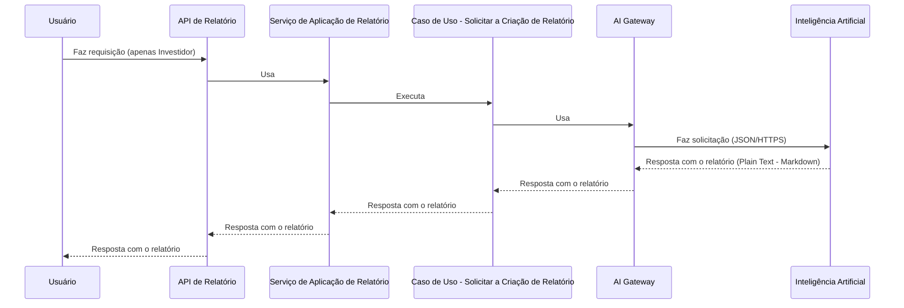
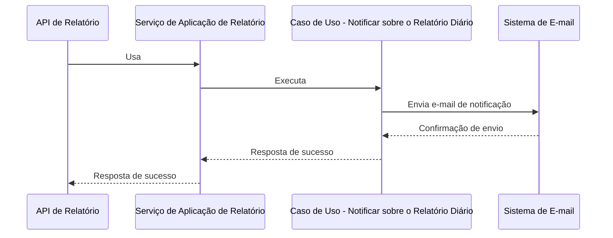
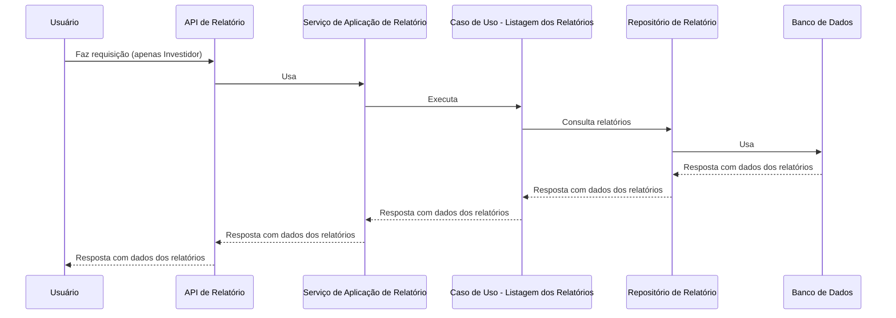
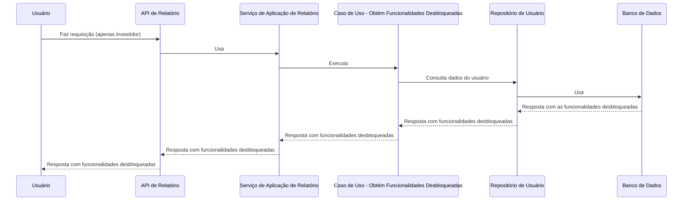

# C3 - Módulo de relatórios

## Casos de uso

### Solicitar a Criação de Relatório:

### Notificar sobre o Relatório Diário:

### Listagem dos Relatórios:

### Obtém Funcionalidades Desbloqueadas:

