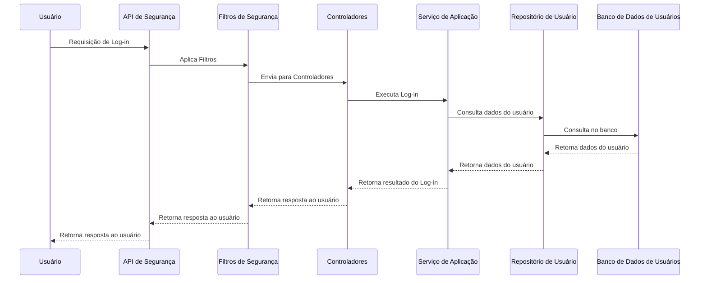
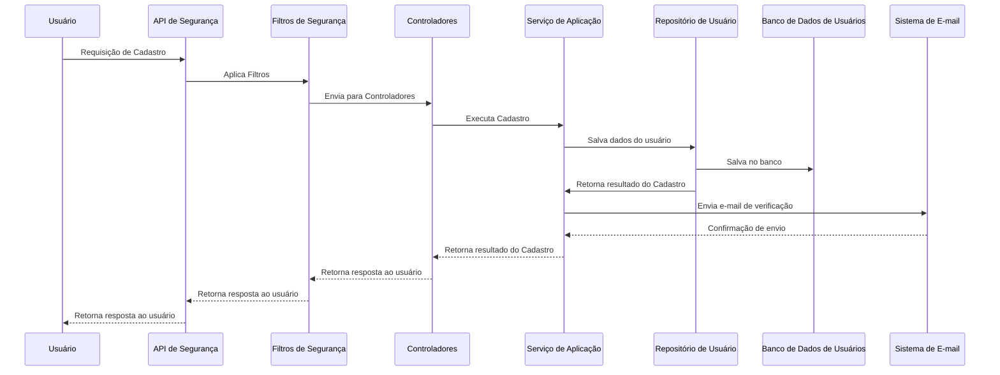
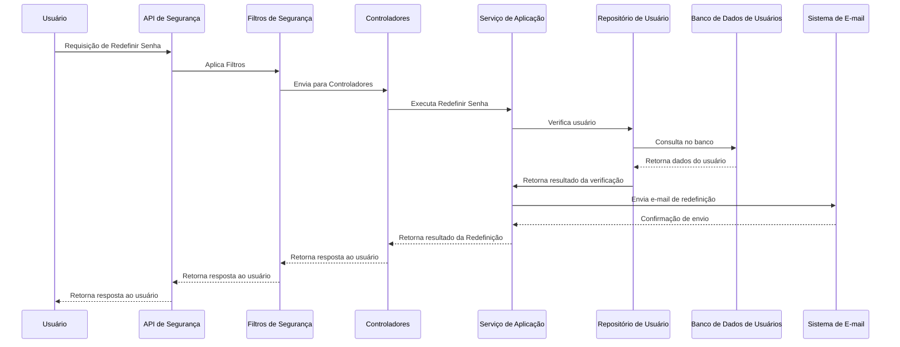

# C3 - Módulo de segurança

## Casos de uso

### Log-in

```mermaid
sequenceDiagram
    participant User as Usuário
    participant SecurityAPI as API de Segurança
    participant SecurityFilters as Filtros de Segurança
    participant SecurityControllers as Controladores
    participant SecurityService as Serviço de Aplicação
    participant UserRepository as Repositório de Usuário
    participant UserDB as Banco de Dados de Usuários

    User->>SecurityAPI: Requisição de Log-in
    SecurityAPI->>SecurityFilters: Aplica Filtros
    SecurityFilters->>SecurityControllers: Envia para Controladores
    SecurityControllers->>SecurityService: Executa Log-in
    SecurityService->>UserRepository: Consulta dados do usuário
    UserRepository->>UserDB: Consulta no banco
    UserDB-->>UserRepository: Retorna dados do usuário
    UserRepository-->>SecurityService: Retorna dados do usuário
    SecurityService-->>SecurityControllers: Retorna resultado do Log-in
    SecurityControllers-->>SecurityFilters: Retorna resposta ao usuário
    SecurityFilters-->>SecurityAPI: Retorna resposta ao usuário
    SecurityAPI-->>User: Retorna resposta ao usuário
```

### Cadastro

```mermaid
sequenceDiagram
    participant User as Usuário
    participant SecurityAPI as API de Segurança
    participant SecurityFilters as Filtros de Segurança
    participant SecurityControllers as Controladores
    participant SecurityService as Serviço de Aplicação
    participant UserRepository as Repositório de Usuário
    participant UserDB as Banco de Dados de Usuários
    participant MailSystem as Sistema de E-mail

    User->>SecurityAPI: Requisição de Cadastro
    SecurityAPI->>SecurityFilters: Aplica Filtros
    SecurityFilters->>SecurityControllers: Envia para Controladores
    SecurityControllers->>SecurityService: Executa Cadastro
    SecurityService->>UserRepository: Salva dados do usuário
    UserRepository->>UserDB: Salva no banco
    UserRepository->>SecurityService: Retorna resultado do Cadastro
    SecurityService->>MailSystem: Envia e-mail de verificação
    MailSystem-->>SecurityService: Confirmação de envio
    SecurityService-->>SecurityControllers: Retorna resultado do Cadastro
    SecurityControllers-->>SecurityFilters: Retorna resposta ao usuário
    SecurityFilters-->>SecurityAPI: Retorna resposta ao usuário
    SecurityAPI-->>User: Retorna resposta ao usuário
```

### Redefinir Senha

```mermaid
sequenceDiagram
    participant User as Usuário
    participant SecurityAPI as API de Segurança
    participant SecurityFilters as Filtros de Segurança
    participant SecurityControllers as Controladores
    participant SecurityService as Serviço de Aplicação
    participant UserRepository as Repositório de Usuário
    participant UserDB as Banco de Dados de Usuários
    participant MailSystem as Sistema de E-mail

    User->>SecurityAPI: Requisição de Redefinir Senha
    SecurityAPI->>SecurityFilters: Aplica Filtros
    SecurityFilters->>SecurityControllers: Envia para Controladores
    SecurityControllers->>SecurityService: Executa Redefinir Senha
    SecurityService->>UserRepository: Verifica usuário
    UserRepository->>UserDB: Consulta no banco
    UserDB-->>UserRepository: Retorna dados do usuário
    UserRepository->>SecurityService: Retorna resultado da verificação
    SecurityService->>MailSystem: Envia e-mail de redefinição
    MailSystem-->>SecurityService: Confirmação de envio
    SecurityService-->>SecurityControllers: Retorna resultado da Redefinição
    SecurityControllers-->>SecurityFilters: Retorna resposta ao usuário
    SecurityFilters-->>SecurityAPI: Retorna resposta ao usuário
    SecurityAPI-->>User: Retorna resposta ao usuário
```
